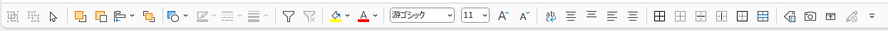

# office-template
template for microsoft office

## excel テンプレート
* フォントの設定
 [ページレイアウト] > [フォント]
 日本語フォント:Meiryo UI, 英字フォント:Segoe UI
* 既定の図形をグレーの中抜きに
* その他（セル幅、プレースフォルダー）

## excel クイックアクセスツールバー

## powerpoint テンプレート

## powerpoint クイックアクセスツールバー

## テンプレート使用方法
1. 「Office のカスタム テンプレート」フォルダへ保存
2. [ファイル] > [新規] > [個人用] 目的のテンプレートを選択